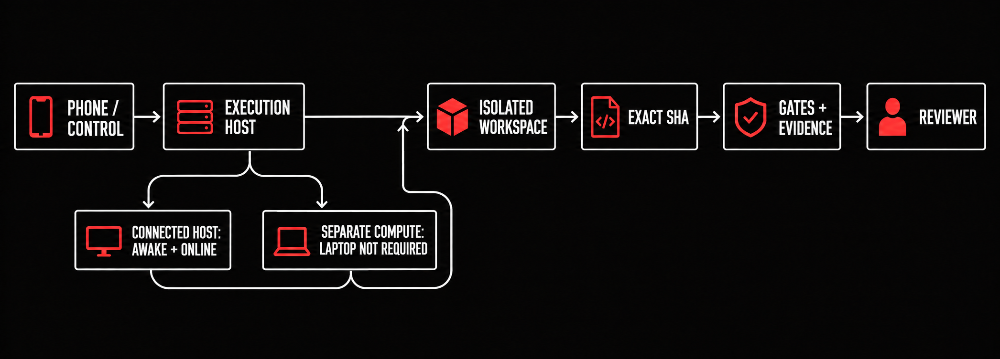

# Verified Remote Agent

**Dispatch one bounded repository change and bring back exact-SHA evidence you can inspect.**

The companion repository for *Remote Coding Agents: Ship Verified Pull Requests Anywhere*.
Book and more at [youcanbuildthings.com](https://youcanbuildthings.com).

This repository gives you a local control plane for job admission, isolated Git worktrees, durable SQLite state, policy decisions, repository-owned checks, evidence verification, capacity limits, and guarded recovery. The bundled adapter changes one documentation fixture in a repository you name; it doesn't contact a hosted service.

[](https://github.com/regardo911/verified-remote-agent/actions/workflows/ci.yml) [](LICENSE)

## Start here

**I have a repository and want to run the local route.** From this clone, point the scaffold at a disposable repository or branch first:

```sh
./remote-agent init /absolute/path/to/disposable/repository && cd /absolute/path/to/disposable/repository && ./remote-agent validate-job remote-job.md
```

`INIT ... dispatch_started=false` followed by `VALID ... dispatch_started=false` means the scaffold was copied and the starter job ID was recorded; no work was dispatched. If a destination path conflicts, `init` refuses before writing. Commit the copied control files, run `init` again to bind `remote-job.md` and the gate fixture to that commit, then replace the reserved fixture ID, branch, and workspace. Use Chapter 4 when you're ready to create a fixture branch and worktree.

## Copy paths into your repository

| Chapter | Copy from this repository | Destination in your repository |
|---|---|---|
| 1 | `chapters/01-name-the-return/remote-work-target.md` | `docs/remote-work-target.md` |
| 2 | `remote-job.md` | `remote-job.md` |
| 3 | `fixtures/evidence/{local,remote}.json` | `evidence/{local,remote}.json` |
| 4 | `remote-agent`, `remote_agent.py` | repository root |
| 5 | `migrations/001_canonical.sql` | `migrations/001_canonical.sql` |
| 6 | `remote-policy.yml` | `remote-policy.yml` |
| 7 | `ci/` | `ci/` |
| 8 | `fixtures/evidence/` | `fixtures/evidence/` |
| 9 | `fixtures/economics.sql` | `fixtures/economics.sql` |
| 10 | `fixtures/queue.sql` | `fixtures/queue.sql` |
| 11 | `migrations/002_mock_effects.sql`, `fixtures/incident-decision.json` | matching paths |
| 12 | `remote-agent.json` created by `init` | repository root |

## Chapter map

| Chapter | Reader action | Command | Observable result |
|---|---|---|---|
| 1 · Name the return | Fix the repository and immutable base | `git rev-parse HEAD` | One real 40-hex commit in the target note |
| 2 · Seal the job | Validate and reserve the full contract | `./remote-agent validate-job remote-job.md` | `VALID` and no dispatch |
| 3 · Pick the runtime | Compare two compatible observations | `./remote-agent runtime-scorecard --attempt evidence/local.json --attempt evidence/remote.json --output runtime-scorecard.csv` | Two attempt rows and one decision row |
| 4 · Send one safe change | Dispatch the local fixture | `./remote-agent dispatch remote-job.md --adapter local-fixture` | A `remote/<job_id>` branch, worktree, and evidence packet |
| 5 · Run the control board | Inspect durable invariants | `./remote-agent status --check --db agent.db` | `STATUS ok` or a nonzero named invariant failure |
| 6 · Enforce the boundary | Compile and explain policy | `./remote-agent policy compile remote-policy.yml --runtime local-fixture` | Digest-bound `compiled-policy.json` |
| 7 · Gate the exact SHA | Reproduce a stored gate receipt | `./remote-agent gate verify fixtures/gate-receipt.json` | `VERIFIED` or a nonzero authenticity refusal |
| 8 · Render the handoff | Capture canonical evidence | `./remote-agent evidence capture fixture-job --db agent.db --branch remote/fixture-job --output evidence.json` | A digest-bound evidence JSON file |
| 9 · Price accepted work | Scope economics to one window | `./remote-agent economics-report --db agent.db --window fixture-window --output economics.csv` | Window-specific rows; undefined denominators stay literal |
| 10 · Measure capacity | Count queue and attempt state | `./remote-agent capacity-report --db agent.db --output capacity.csv` | A CSV tied to current durable state |
| 11 · Break and restore | Run the guarded failure range in an empty directory | See `chapters/11-break-and-restore/` | A passing receipt with 17 executed cases |
| 12 · Adopt and upgrade | Inspect before changing config | `./remote-agent upgrade inspect --config remote-agent.json` | Installed and supported versions, without mutation |

Open the short route in each `chapters/` directory before applying a command to your project.

## Architecture



The local route keeps one ownership chain: a bounded contract enters a named execution host, work occurs in its own worktree, and every check and review artifact binds to the returned commit. Connected-host and hosted-runner routes are adapter choices; they rejoin the same proof chain.

## Requirements and live boundary

The local fixture uses a POSIX shell, Python's standard library, Git, and SQLite through Python. It needs no environment file, account, key, or network connection. No Python version floor is asserted here.

Hosted runtimes, phone clients, repository APIs, billing exports, and human review are optional, reader-owned integrations. Codex, Claude Code, OpenCode, AgentCore, GitHub, and `gh` commands mentioned in the chapter routes are live adapter surfaces only. This repository doesn't run them or claim their results. A production adapter must preserve the same contract, policy, state, evidence, and refusal semantics.

## Safety

Start on a disposable repository or branch. Read the contract and policy before dispatch, keep credentials out of files and command lines, and leave publishing and irreversible effects behind separate approval. See [the full safety and liability notice](DISCLAIMER.md).

## Configuration

- `remote-job.md` defines the immutable base SHA, allowed and denied paths, fixed acceptance commands, limits, stop rules, evidence requirements, and effect identity.
- `remote-policy.yml` is the flat parser-backed policy source. Unknown fields fail closed; the compiled digest identifies what the local adapter consumed.
- `remote-agent.json` records scaffold and schema versions after initialization.
- `ci/` contains four leaf/verifier checks plus the closed-set aggregate evaluator.

Generated databases, worktrees, evidence logs, receipts, and reports are project-local and ignored by default. Keep any record you rely on in controlled storage before cleanup.

## Contributing and license

Changes should preserve offline behavior, add a refusal test for any relaxed boundary, and keep fixtures deterministic. Read [CONTRIBUTING.md](CONTRIBUTING.md) before opening a change.

Licensed under the [MIT License](LICENSE). More practical build systems: [youcanbuildthings.com](https://youcanbuildthings.com).

Bring back proof that a reviewer can reproduce.
