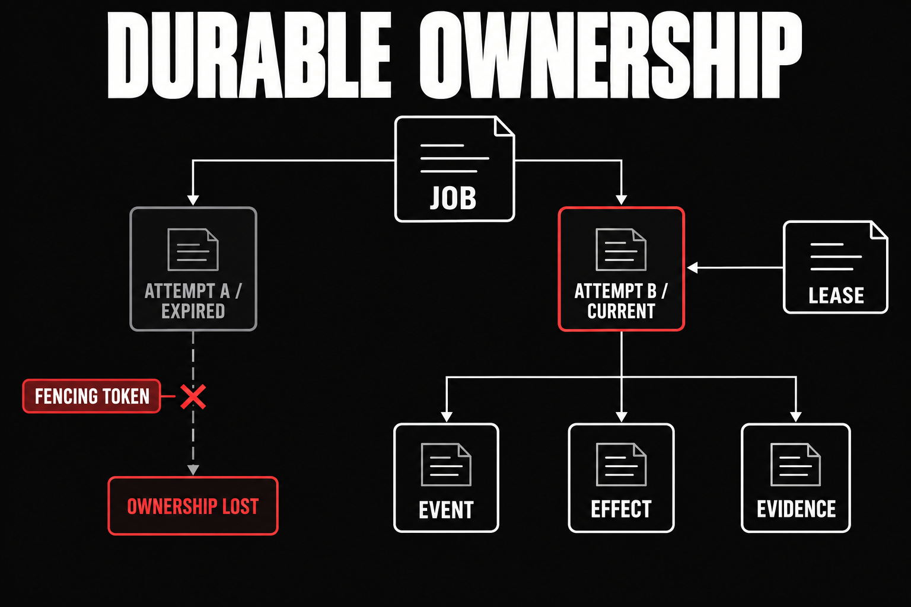

# Chapter 5 — Run the control board

`migrations/001_canonical.sql` owns the finite job states, attempts, leases, events, effects, evidence, policy decisions, and queue records. Initialization applies it idempotently.

## Read the invariant

Check what is durable, not what a terminal happens to show:

```sh
./remote-agent status --check --json --db agent.db
```

Success is JSON with `"ok": true`; invalid ownership, missing evidence, foreign-key damage, or failed integrity returns nonzero. In your repository, treat the migration as an append-only interface and make every worker acquire ownership through the same transaction and fencing token before effects.


