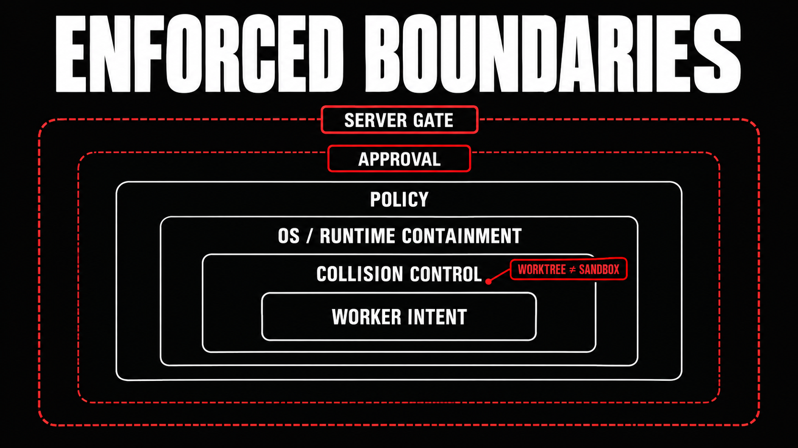

# Chapter 6 — Enforce the boundary

The policy source is deliberately flat because the supplied parser consumes that schema. It still carries filesystem read/write/deny rules, fixed command allow/ask/deny sets, network aliases, plaintext denial, credential bindings, approval-required effects, and publishing denial.

## Compile what runs

```sh
./remote-agent policy compile remote-policy.yml --runtime local-fixture
./remote-agent policy explain compiled-policy.json --job remote-job.md
```

A compiled digest and JSON explanation are the useful outputs. Unknown fields or symbols, digest drift, permissive publishing, or missing control groups must refuse. Map the stable names to your runtime's filesystem, process, network, credential, approval, and server-side controls; a worktree alone isn't containment.


