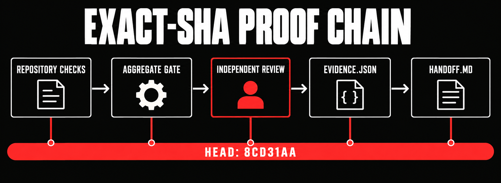

# Chapter 7 — Gate the exact SHA

First reproduce the bundled receipt:

```sh
./remote-agent gate verify fixtures/gate-receipt.json
```

`VERIFIED` means the commit, evidence digest, checks, reviewer identity, approval digest, and receipt digest agree. Change any one and the command exits 2.

## Aggregate raw results

For a real returned commit, feed `./ci/aggregate-gate results.json` exactly five authoritative results: `format`, `unit`, `types`, `evidence`, and `independent-review`. Every result needs explicit `success`, the same full SHA, and its expected source. Missing, duplicate, skipped, cancelled, malformed, wrong-source, and mixed-SHA sets fail closed. Configure branch protection against that aggregate result; the fixture registry isn't a substitute for your reviewer authority.

A valid input has one top-level SHA and acceptance digest, then result objects shaped like this:

```json
{
  "name": "evidence",
  "status": "success",
  "head_sha": "0123456789abcdef0123456789abcdef01234567",
  "source": "evidence-verifier"
}
```

Use `repository-check` for `format`, `unit`, and `types`; use `review-registry` for `independent-review`. Optional results may appear for display, but they can't fill a required slot. The script repeats the evaluated SHA and acceptance digest in its passing receipt, so a caller can bind the aggregate to the same contract revision.


