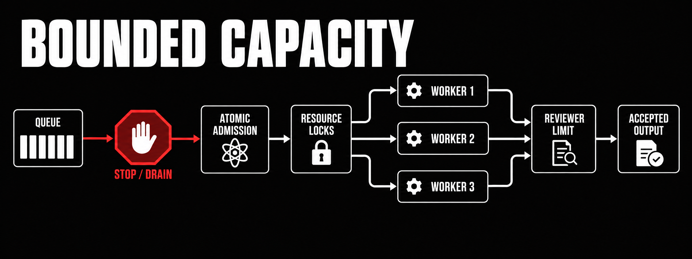

# Chapter 10 — Measure capacity

Capacity starts with atomic admission, not a worker-count guess. In an initialized disposable repository:

```sh
sqlite3 agent.db < fixtures/queue.sql
./remote-agent queue claim queue-one --attempt-id queue-a1 --resource docs/shared.md --worker-limit 2 --db agent.db
./remote-agent capacity-report --db agent.db --output capacity.csv
```

The claim returns a fencing token and the scorecard reflects current queue and attempt state. A second claim for `docs/shared.md`, a stale release token, a crossed budget, or a stopped queue must exit 2. Replace the fixture resources and limits with the actual collision domains and reviewer capacity in your repository; the smallest bottleneck sets useful throughput.


