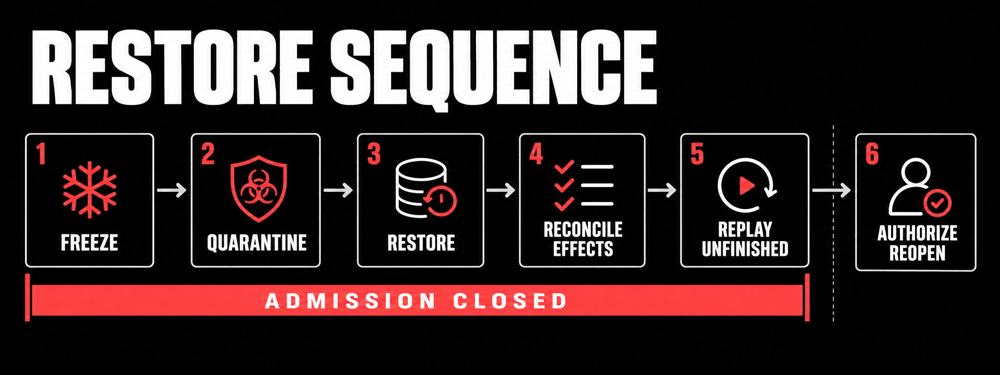

# Chapter 11 — Break and restore

Run the failure range from a new empty directory so its inspectable databases can't collide with project state:

## Keep the failure range empty

```sh
scaffold=$(pwd); drill_dir=$(mktemp -d); (cd "$drill_dir" && "$scaffold/remote-agent" drill --create-temp --expected-suffix remote-agent-failure-range --receipt drill-receipt.json)
```

The receipt says `PASS` only after 17 cases execute: transaction-boundary kills, paired filesystem and network controls, stale-owner fencing, duplicate and ambiguous effects, corrupt/skipped/SHA evidence refusals, restore, replay, and stopped admission. Keep the emitted databases until you've inspected them.

For your system, freeze new admission before recovery, write the incident decision, restore to a new target, reconcile ambiguous effects, replay only unfinished work, and authorize reopen separately.


